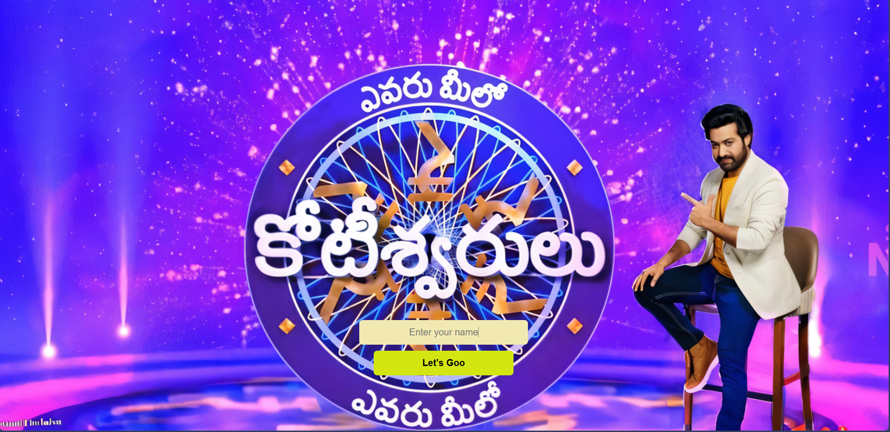
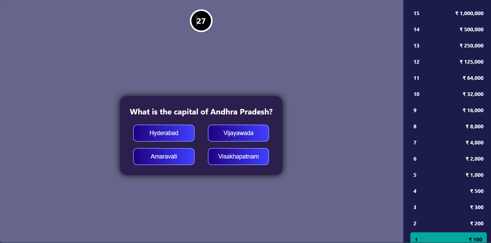

# EMK Quiz App
 
A web-based quiz game inspired by the Telugu game show **Evaru Meelo Koteswarudu**, built with React and Vite. Test your knowledge across 15 progressive questions with a ticking timer, increasing difficulty, and randomized rounds — just like the real show!
 
> Built by **Maganti Praveen Sai**
 
[](https://evaru-meelo-koteeswarulu.onrender.com)
[](https://reactjs.org/)
[](https://vitejs.dev/)
 
---
 
## Highlights
 
- 15-question round with difficulty distribution:
  - 4 Easy
  - 5 Medium
  - 2 Mixed
  - 4 Hard
- Randomized question selection within each difficulty pool
- 30-second timer per question with urgency effects
- Win and game-over result states
- Progress persistence using localStorage
- Keyboard-friendly answer controls and accessibility improvements
- Unit tests for quiz utility logic
 
## Tech Stack
 
- React
- Vite
- ESLint
- Vitest
 
## Project Structure
 
```
.
|-- public/
|-- src/
|   |-- components/
|   |-- data/
|   |-- utils/
|   |-- App.jsx
|   `-- main.jsx
|-- index.html
|-- package.json
`-- vite.config.js
```
 
## Getting Started
 
### 1. Install dependencies
 
```bash
npm install
```
 
### 2. Run in development
 
```bash
npm run dev
```
 
Open the local URL shown in terminal (usually http://localhost:5173).
 
## Scripts
 
| Command | Description |
|---|---|
| `npm run dev` | Start development server |
| `npm run build` | Create production build |
| `npm run preview` | Preview production build locally |
| `npm run lint` | Run ESLint checks |
| `npm run test` | Run Vitest in watch mode |
| `npm run test:run` | Run Vitest once |
 
## Gameplay Rules
 
- Each round shows 15 questions in increasing difficulty order: Easy → Medium → Mixed → Hard.
- Questions are randomly selected from each difficulty pool every round.
- A correct answer moves you to the next question.
- A wrong answer or timeout ends the round immediately.
- Final result screen displays your earned amount.
- "Play Again" starts a fresh randomized round.
 
## Data Model
 
Questions are stored in `src/data/questions.js` with this shape:
 
```js
{
  id: 1,
  difficulty: "easy", // easy | medium | mixed | hard | expert
  text: "Question text",
  options: ["A", "B", "C", "D"],
  correct: 2 // zero-based index (0 = A, 1 = B, 2 = C, 3 = D)
}
```
 
## Notes
 
- The app validates question objects before using them.
- Quiz state is saved to localStorage and restored if the session is still valid.
 
## Roadmap
 
- [ ] Include Expert-level questions in the 15-question distribution
- [ ] Add lifelines (50-50, Phone a Friend, Audience Poll)
- [ ] Leaderboard with high scores
- [ ] Sound effects and background music
- [ ] Telugu language mode
 
## Screenshots
 
### Intro Page
 

 
### Quiz Page
 

 
### Result Page
 

 
## Feedback
 
Found a bug or want to suggest a question? Feel free to open an issue or reach out!
 
## Live Demo
 
[https://evaru-meelo-koteeswarulu.onrender.com](https://evaru-meelo-koteeswarulu.onrender.com)
 
## License
 
For educational and personal use.
 